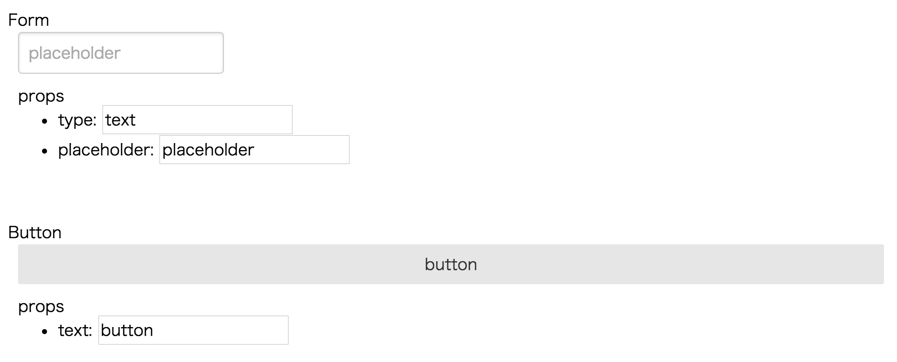

# react-showcase

Make it easy to create your own react component showcase site.

## Install

`$ npm install --save react-showcase`

## Usage

```js
import showcase from 'react-showcase';

const myComponents = [Form, Button];
const showcases = myComponents.map(Component => {
  const Showcase = showcase(Component);
  reutrn <Showcase key={Component.name}/>
});

function App() {
  return <div>{showcases}</div>
}

ReactDOM.render(<App />, document.getElementById('showcase'));
```

It shows...



## Api

### `showcase(Component)` (default exported)

This function returns showcase component of `Component` argument.

### `defaultStyles` (named exported)

## License

MIT
