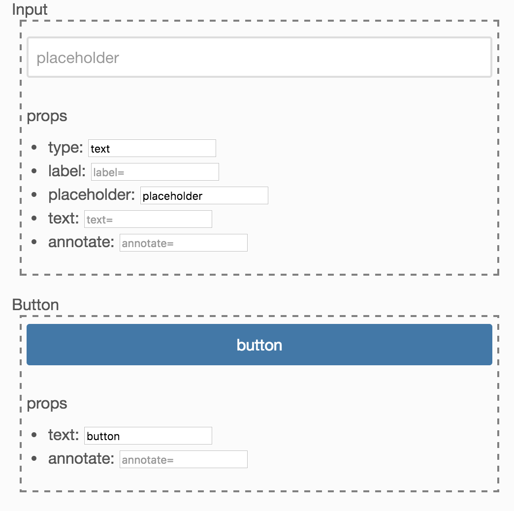

# react-showcase [](https://travis-ci.org/airtoxin/react-showcase)

Make it easy to create your own react component showcase site.

## Install

`$ npm install --save react-showcase`

## Usage

```js
import showcase from 'react-showcase';

const myComponents = [Input, Button];
const showcases = myComponents.map(Component => {
  const Showcase = showcase(Component);
  reutrn <Showcase key={Component.name}/>
});

function App() {
  return <div>{showcases}</div>
}

ReactDOM.render(<App />, document.getElementById('showcase'));
```

It shows...



## Api

### `showcase(Component)` function (default exported)

__return__: `Showcase` component

This function returns your `Component` wrapped by `Showcase` component.

### `defaultStyles` object (named exported)

If you want to override showcase component styles, this can be used for base styling.

### `Showcase` component

`<Showcase styles={myStyles} />`

It has styles property to override showcase styles.

```js
import { defaultStyles } from "react-showcase";

const myStyles = Object.assign({}, defaultStyles, {
  article: { border: "dashed 2px red" }
});

const Wrapped = showcase(MyComponent);
ReactDOM.render(
  <Wrapped styles={myStyles} />,
  document.getElementById("showcase")
);
```


## License

MIT
